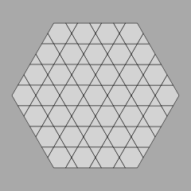

# Tiles

Our aim is to

* learn Rust
* generate Spectre and Hat tilings
* generate Penrose tilings

It's going to be quite a journey.  We'll start small.

To run:

```sh
cargo build
cargo run
```

Then observe `src/out.svg` in some preview or browser.




See [release notes](./RELEASES.md).