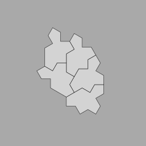

# Tiles

Our aim is to

* learn Rust
* generate Spectre and Hat tilings
* generate Penrose tilings

We'll be using [convenient coordinate systems](./doc/omega-space.md) to make the calculations easier.

It's going to be quite a journey.  We'll start small.

To run:

```sh
cargo run
```

Then observe the output SVG in some preview or browser (or here).

  

See [release notes](./RELEASES.md).
