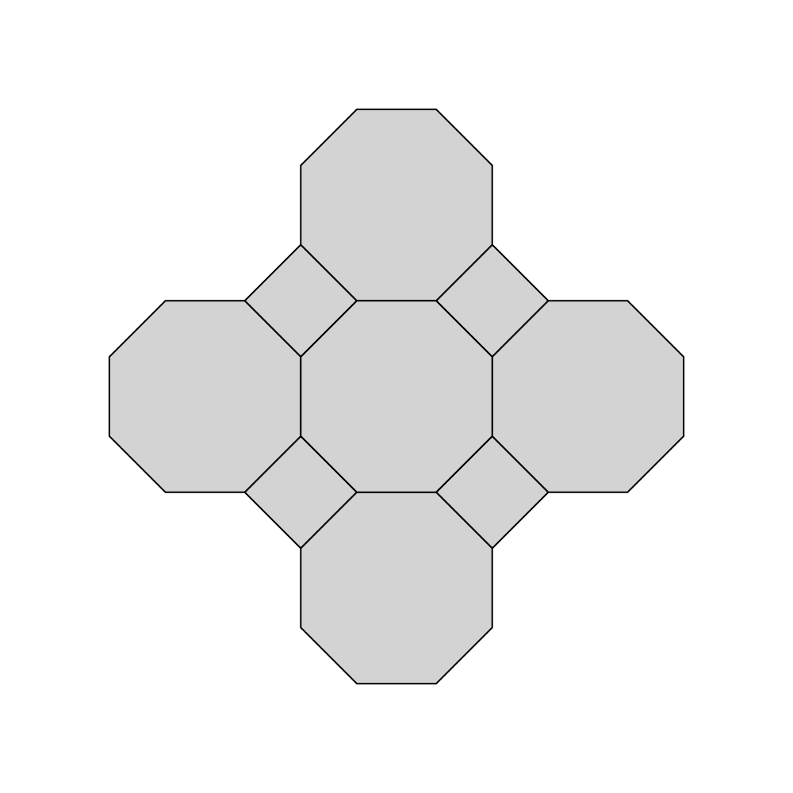

# Releases

## v0.2.0, 2024-04-10 08:33 BST

Features:

* `omega8` implements an 8-direction coordinate system using $[1, \sqrt 2]$ as basis increments in $x$ and $y$ directions
* we use this in `tesselation` to construct a tesselation with one central octagon, then four surrounding octagons and four surrounding squares, with all computations being done in omega8 space

The Rust journey:

* 2.5 days into Rust
  * primarily using Android team's [Comprehensive Rust](https://google.github.io/comprehensive-rust) as a guide, doing their first two days thoroughly
  * also using Rust official ref doc a lot, eg [std](https://doc.rust-lang.org/stable/std/), and [book](https://doc.rust-lang.org/stable/book/)
  * jumped the gun on very simple modules and Cargo stuff required here
* using VS Code `rust-analyzer` plugin
  * disabling inlay hints
  * probably should be trying the newer `rust` plugin which has fewer downloads but super-high rating
  * combination of in-IDE type-checking and messages from compiler is an effective coding assist
* now blocked by need to make a decision about referencing and borrowing
  * issue is that points in previous shapes are "re-used" as anchors for next shape
  * but once you push the previous shape to the model, the whole shape is considered to have moved to the model and you can't reference it again
  * this isn't an issue in JS, Python, Hack which I'm currently using; and can be fudged in C/C++ because it's not so strict on this kind of thing -- in Rust I'm going to have to think about it

So for 0.3.0 the natural ambitions are going to be

* do more Rust course and formulate an appropriate strategy for "re-using" whether by borrowing or referencing consistently
* do a bigger octagon-and-square tesselation which relies on the above breakthrough
