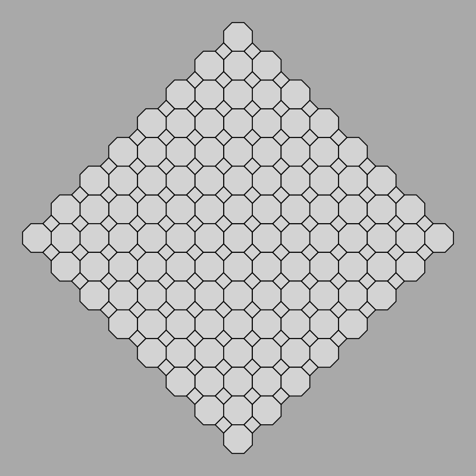
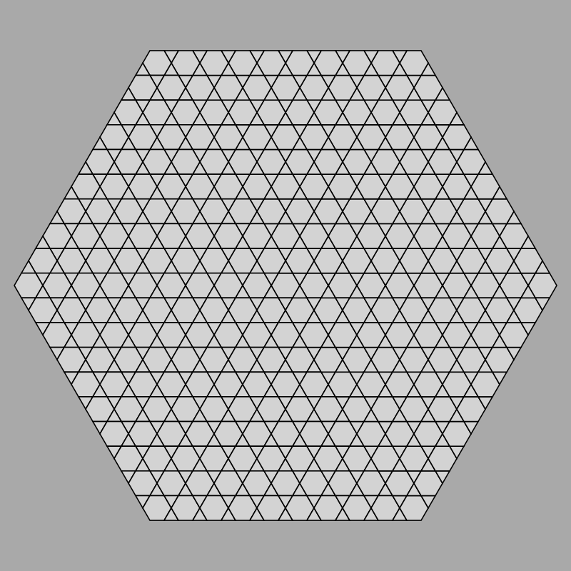

# Releases

## work in progress

Features:

* needed refactoring to split 12 and 8-ness from models
* needed support for negative angles, for concave shapes

Must-do:

* to get further tiling without resorting to direct coordinate arithmetic in model, even manually placed, need to be able to align start of next shape starting at an arbitrary point within the shape, not just at zero

## v0.3.0, 2024-04-10 22:21 BST

Features:

* `omega12` implements 12-direction coordinate system using $[1, \sqrt 3]$ as basis increments
* we use this to construct a tesselation with one central hexagon, then layers of surrounding hexagons and triangles
* we've upgraded the octagon-and-square tesselation also to do many surrounding layers

In terms of Rust,

* now on day 3, using the same materials
* using the builder pattern
* fixing borrowing issues
* beginning to use generics
* implemented some rather trivial test code

So this solves the issues anticipated from v0.2.0.  For the next release, we'll

* introduce a Spectre
* attempt to improve on generics
* do much-needed tidying up between 8- and 12-direction and common things anyway

## v0.2.0, 2024-04-10 08:33 BST

Features:

* `omega8` implements an 8-direction coordinate system using $[1, \sqrt 2]$ as basis increments in $x$ and $y$ directions
* we use this in `tesselation` to construct a tesselation with one central octagon, then four surrounding octagons and four surrounding squares, with all computations being done in omega8 space

The Rust journey:

* 2.5 days into Rust
  * primarily using Android team's [Comprehensive Rust](https://google.github.io/comprehensive-rust) as a guide, doing their first two days thoroughly
  * also using Rust official ref doc a lot, eg [std](https://doc.rust-lang.org/stable/std/), and [book](https://doc.rust-lang.org/stable/book/)
  * jumped the gun on very simple modules and Cargo stuff required here
* using VS Code `rust-analyzer` plugin
  * disabling inlay hints
  * probably should be trying the newer `rust` plugin which has fewer downloads but super-high rating
  * combination of in-IDE type-checking and messages from compiler is an effective coding assist
* now blocked by need to make a decision about referencing and borrowing
  * issue is that points in previous shapes are "re-used" as anchors for next shape
  * but once you push the previous shape to the model, the whole shape is considered to have moved to the model and you can't reference it again
  * this isn't an issue in JS, Python, Hack which I'm currently using; and can be fudged in C/C++ because it's not so strict on this kind of thing -- in Rust I'm going to have to think about it

So for 0.3.0 the natural ambitions are going to be

* do more Rust course and formulate an appropriate strategy for "re-using" whether by borrowing or referencing consistently
* do a bigger octagon-and-square tesselation which relies on the above breakthrough
